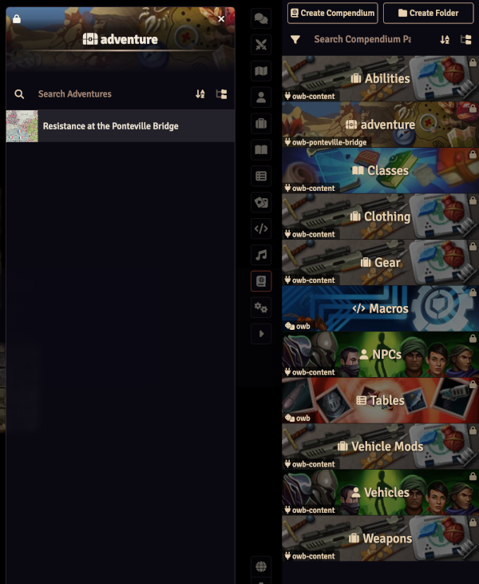

# foundryvtt-owb-ponteville

**Resistance at the Ponteville Bridge** is an introductory support mission for a group of three to six operatives of **1st-3rd** level.

The Allies are planning a large raid on the fictional port city of St. Croix la Mer and the characters must destroy a key set of crossings in order to prevent German reinforcements from reaching the coast.

## Package Description

Welcome to **Resistance at the Ponteville Bridge**, the introductory scenario included with the [WWII: Operation WhiteBox™ rules](https://www.drivethrurpg.com/product/196284/OWB001-WWII-Operation-WhiteBox) from Small Niche Games™.

The mission is a *mini-sandbox* that includes sabotage as well as opportunities for combat and roleplaying, so a good mix of Character Classes is suggested.

This package includes all the NPCs, Vehicles and Weapons described in the scenario, briefing Journal entries and Maps, and Scenes for the Ponteville village, and the three floors of the Ponteville Tavern.

## Installing

You should be able to install this by clicking  `Install Module` within Foundry VTT on the **Add-on Modules** tab, and providng the [manifest URL](https://github.com/chrisesharp/foundryvtt-owb-ponteville/releases/latest/download/module.json)

It has both the [WWII:OWB](https://github.com/chrisesharp/foundryvtt-owb/releases/latest/download/system.json) and [WWII:OWB OGL content pack](hhttps://github.com/chrisesharp/foundryvtt-owb-content/releases/latest/download/module.json) as dependencies, which should be installed when asked.

When you have installed the module, now create a **New World** and enable this module within it, then import the Adventure from the adventure compendium.

## License

This third party product is not affiliated with, but is approved by, Small Niche Games™. \
WWII: Operation WhiteBox™ is a trademark of Peter C. Spahn.\
Small Niche Games™ is a trademark of Peter C. Spahn.

This scenario textual content is copyright Small Niche Games™, and is reproduced by kind permission of Peter C. Spahn. Used with permission under license.

